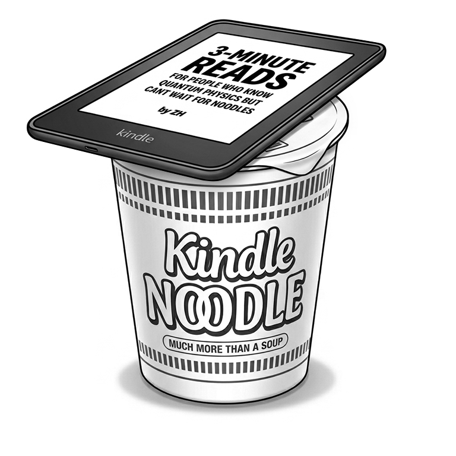

# Kindle Noodle 🍜


**把吃灰的 Kindle 变成你的桌面搭子。**

一个纯 HTML 单文件 Web App，专为 Kindle Paperwhite 的 E-ink 屏幕设计，让闲置的 Kindle 在桌面上重新发光。

🔗 **在线体验**：[kindlenoodle.com](https://kindlenoodle.com)



---

## 📺 视频介绍

📺 [点击观看完整介绍视频（B站）](https://www.bilibili.com/video/BV1fWju6vEZo/?spm_id_from=333.1387.homepage.video_card.click&vd_source=bffaec2ad547755a7de74fb6c41ea36f)

---

## ✨ 功能一览


**🕐 翻页时钟 / 模块时钟**
两种风格可切换，E-ink 屏幕上的复古感拉满。

**🍅 番茄计时**
25 分钟专注倒计时，帮你进入沉下心的状态。

**🍜 盖泡面计时器**
Kindle 终于干回了它的老本行 —— 给泡面盖盖子。

**📖 阅读模式**
一键跳转微信读书，让 Kindle 重新成为阅读工具。

**📰 AI 日报**
每天自动更新 AI 领域的最新动态，数据来源于 [AI HOT](https://aihot.virxact.com)。

---

## 📱 如何使用

1. 打开 Kindle 的「体验版浏览器」
2. 在地址栏输入 `kindlenoodle.com`
3. 开启屏幕常亮（见下方说明，**不是网页功能**）
4. 放在桌面上，开始享用

也可以在手机或电脑浏览器上直接访问体验。

---

## 🔆 屏幕常亮说明（`~ds` 为什么失效，以及怎么修）

### 今日结论摘要

| 问题 | 结论 |
|------|------|
| 网页能让 Kindle 常亮吗？ | **不能**。常亮是 Kindle 系统能力，不是 Kindle Noodle 网站功能 |
| `~ds` 是什么？ | Kindle 主页搜索框里的隐藏命令，用来暂时关闭屏保 |
| 为什么有的机器输入 `~ds` 没用？ | 亚马逊从固件 **5.14.2** 起移除了该命令 |
| Paperwhite 7 代 / 固件 5.14.2 怎么办？ | 用空文件 `TESTD_PREVENT_SCREENSAVER`，或用本仓库 Mac 一键脚本 |
| 短按电源键能关屏吗？ | 开常亮后，短按电源通常**不能**休眠；要恢复正常须关掉常亮再重启 |

### 为什么 `~ds` 在某些版本不可用？

`~ds`（disable screensaver）曾经是 Kindle 的系统隐藏开关：

1. 回到 Kindle **主页**
2. 在顶部 **搜索框**（不是浏览器地址栏）输入小写 `~ds`
3. 回车后通常没有提示，但屏保会被暂时关掉
4. **重启后自动恢复**正常休眠

从固件 **5.14.2** 开始，亚马逊把这条命令从系统映射里删掉了（相关配置在 `debug_cmds.json`）。  
因此：

- 固件 **&lt; 5.14.2**：`~ds` 通常仍可用  
- 固件 **≥ 5.14.2**（例如 Paperwhite 7 代升到 5.14.2）：输入 `~ds` 只会当普通搜索，**不会常亮**

查看版本：主页 → 设置 → 设备选项 → 设备信息。

常见踩坑（即使旧固件也会踩）：

- 在浏览器地址栏输入 → 无效  
- 写成 `~DS` 或带空格 → 无效  
- 成功后短按电源键无法锁屏 → 正常现象  

### 修改办法：空文件常亮（不越狱）

在 Kindle 根目录（和 `documents` 同级）放一个空文件：

```text
TESTD_PREVENT_SCREENSAVER
```

然后安全弹出、重启 Kindle。效果接近旧版 `~ds`：自动屏保被关掉，短按电源通常也无法休眠。

和旧 `~ds` 的关键区别：

| | 旧 `~ds` | `TESTD_PREVENT_SCREENSAVER` |
|--|---------|------------------------------|
| 是否需要越狱 | 否 | 否 |
| 固件 ≥ 5.14.2 | ❌ 不可用 | ✅ 可用（至少在 5.14.x～5.15.x 等版本有验证） |
| 重启后 | 自动恢复休眠 | **仍然常亮**（文件还在） |
| 关闭方式 | 重启即可 | 删除该文件后再重启 |

### Mac 一键脚本（推荐）

不想每次手建/删文件，可用本仓库脚本：

| 文件 | 作用 |
|------|------|
| [`scripts/kindle-awake-on.command`](scripts/kindle-awake-on.command) | 开启常亮（自动创建空文件） |
| [`scripts/kindle-awake-off.command`](scripts/kindle-awake-off.command) | 关闭常亮（自动删除空文件，恢复休眠） |

使用步骤：

1. USB 连接 Kindle，屏幕显示 **USB Drive Mode**，Finder 侧边栏出现 **Kindle**
2. 双击对应脚本
3. Finder 推出 Kindle → 拔线 → **重启 Kindle**（必须重启才生效）

排障与说明见 [`scripts/README.md`](scripts/README.md)。

> 注意：网页无法代替上述系统开关。越狱后也可用 KUAL 等扩展管理休眠，但本项目不涉及越狱，不建议新手轻易尝试。

---

## 🖥 兼容设备

专为 Kindle 的 E-ink 屏幕优化，同时兼容多种分辨率：

| 设备 | 屏幕宽度 | 状态 |
|------|---------|------|
| Kindle Paperwhite 2 | 758px | ✅ 主要适配 |
| Kindle Paperwhite 3（7代）/ 4 | 1072px | ✅ 兼容（界面会自动缩放） |
| Kindle Oasis | 1264px | ✅ 兼容 |
| Kindle 基础版 | 600px | ✅ 兼容 |
| 桌面 / 手机浏览器 | 任意 | ✅ 可用 |

### E-ink 适配细节

- 不使用 CSS `animation` / `transition`（E-ink 不支持）
- 使用线条替代阴影（避免 E-ink 残影）
- 字体最小 28px（适配 E-ink 的高 PPI 显示）
- 屏幕常亮依赖 Kindle 系统能力（`~ds` 或 `TESTD_PREVENT_SCREENSAVER`），网页本身无法强制常亮

---

## 📦 项目结构

```
KindleNoodle/
├── index.html              # 整个 App（单文件架构）
├── data/
│   └── daily.json          # AI 日报数据（每日自动更新）
├── img/                    # 图片资源
├── scripts/
│   ├── kindle-awake-on.command   # Mac：开启常亮
│   ├── kindle-awake-off.command  # Mac：关闭常亮
│   └── README.md                 # 脚本使用说明
├── .github/
│   └── workflows/
│       └── fetch-aihot.yml # GitHub Actions 自动抓取日报
└── CNAME                   # 自定义域名配置
```

---

## 🔄 AI 日报自动更新机制

```
cron-job.org（每天早上 8:15 北京时间）
    ↓ 调用 GitHub API 触发 workflow
GitHub Actions 启动
    ↓ 从 AI HOT API 抓取最新日报
data/daily.json 自动更新
    ↓ GitHub Pages 自动部署
Kindle 刷新页面即可看到最新内容
```

---

## 🛠 技术栈

- **前端**：纯 HTML + CSS + JavaScript（单文件，无框架依赖）
- **设计**：Figma → Figma MCP → Claude Code
- **部署**：GitHub Pages + Cloudflare（DNS + Analytics）
- **自动化**：GitHub Actions + cron-job.org
- **数据源**：[AI HOT API](https://aihot.virxact.com)

---

## 🏗 开发方式

这个项目完全通过 **Vibe Coding** 构建 —— 设计稿在 Figma 中完成，通过 Figma MCP 让 Claude Code 直接读取设计稿并生成代码，再手动微调细节和硬件适配。

AI 完成了大约 60-70% 的初稿工作，剩下的 30-40%（品味判断、文化语境、E-ink 硬件适配）是 AI 无法替代的人工打磨。

---

## 📊 隐私说明

本项目使用 Cloudflare Web Analytics 收集匿名访问统计数据。该服务不使用 Cookie，不收集任何个人身份信息，符合 GDPR 规范。

---

## 📄 License

MIT

---

## 🧩 已知问题与改进方向

| 问题 | 说明 | 建议 |
|------|------|------|
| `~ds` 在新固件失效 | 固件 ≥ 5.14.2 已移除该命令 | 使用 `TESTD_PREVENT_SCREENSAVER` 或 `scripts/` 一键脚本 |
| 空文件常亮不会随重启消失 | 与旧 `~ds` 不同，文件会持久生效 | 不用时运行 `kindle-awake-off.command` 后重启 |
| 时区默认东八区 | 无网时用北京时间；有网会请求 ip-api | 网络异常时可能显示本地时区偏差 |
| 时钟每分钟刷新 | `setInterval(60000)` 不与整分钟对齐 | 可改为对齐到下一整分再每分钟更新 |
| 单文件体积偏大 | `index.html` 含全部 UI/逻辑 | 对 Kindle 体验版浏览器仍可接受；拆分需评估兼容性 |

---

## 🙋 关于作者

**正号ZH**

外企产品设计师 | 对世界保持好奇，正在积极拥抱AI～
